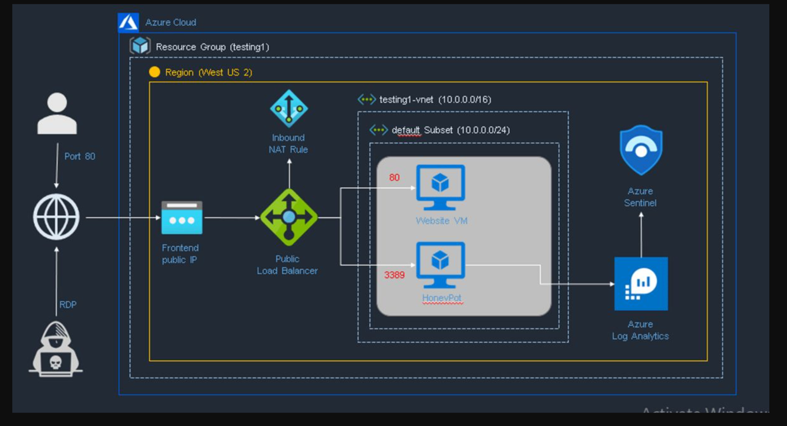
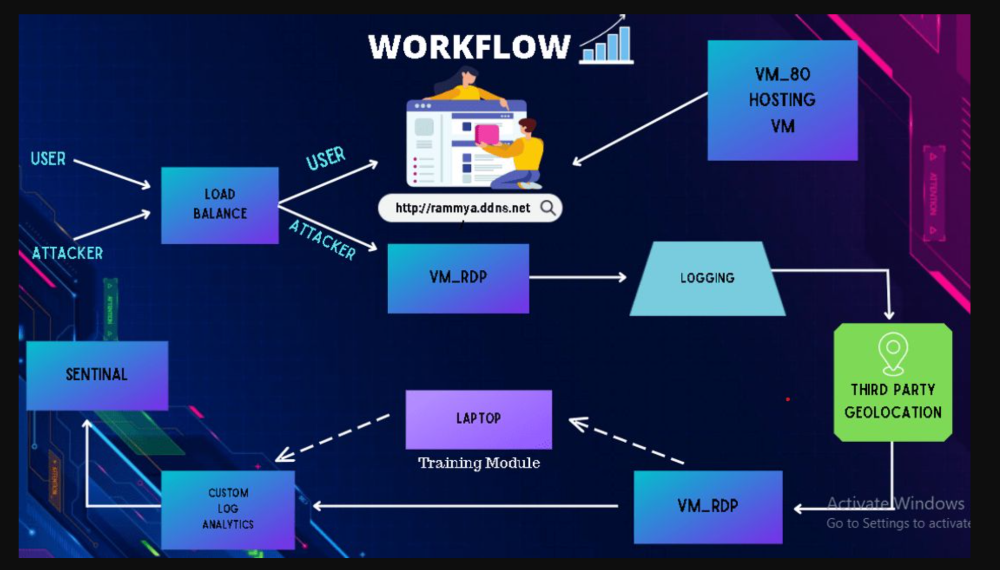
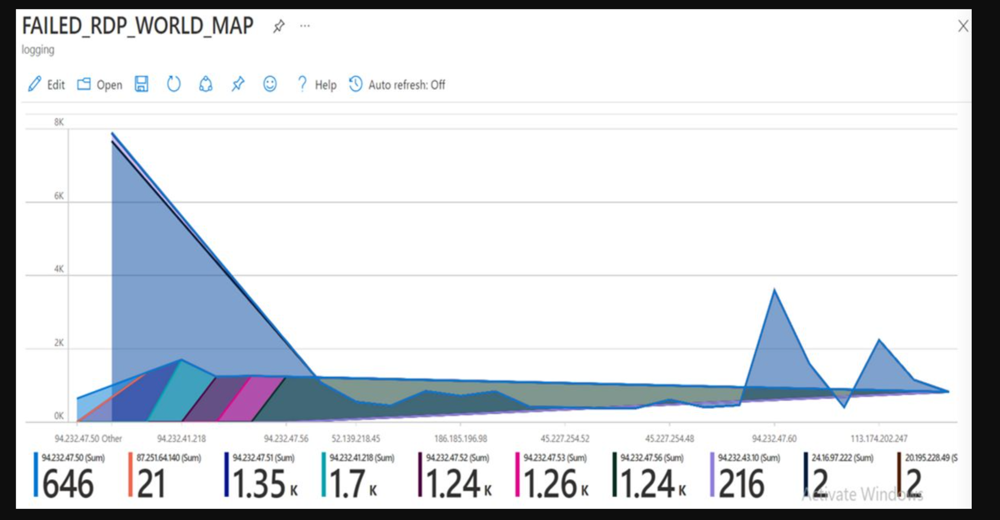
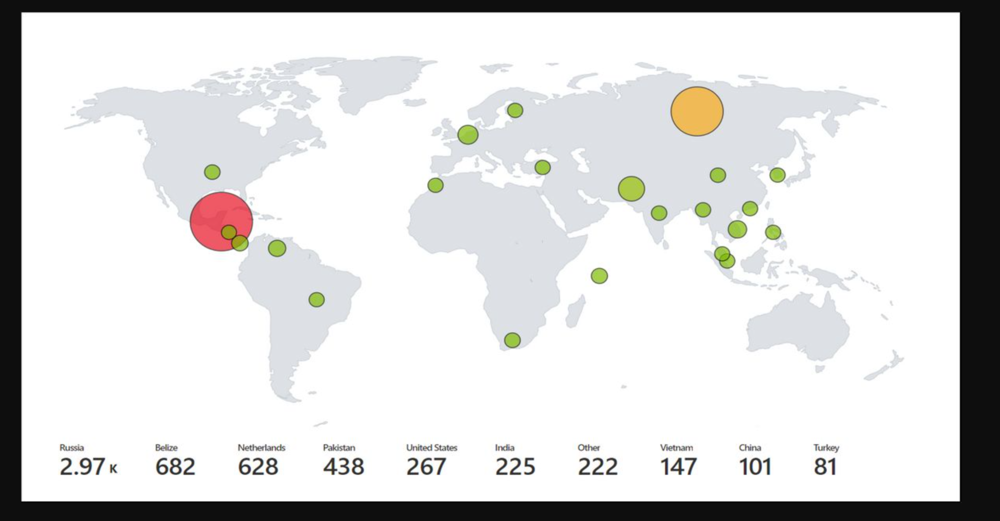

HEAD
# Azure Honeypot & SIEM-Based Threat Visualization Project

This repository documents the architecture, workflow, and results of a security project built using **Azure Cloud, Load Balancer, VMs, Honeypot Logging, Azure Log Analytics, and Azure Sentinel**.

> **Note:** This project focuses on secure architecture design and network monitoring using Azure services. While source code is not included, all infrastructure, visualization, and analysis components were implemented and tested.

---

## Overview

This project was designed in two integrated modules:

1. **Load Balancer + Honeypot**  
   To detect, divert, and isolate malicious RDP/SSH traffic away from the client’s website by rerouting it to a honeypot VM using customized NAT rules.

2. **Log Analysis + SIEM**  
   To visualize and analyze malicious traffic using **Azure Sentinel** and **Log Analytics**, including:
   - Source IP addresses
   - Port-based attack patterns
   - Global attacker geolocation heatmaps

---

##  Architecture

- VM_80 hosted the legitimate client-facing website
- VM_RDP served as the honeypot
- Azure Load Balancer differentiated traffic:
  - Port 80 → VM_80
  - Port 3389/22 → VM_RDP
- Logs were exported from Windows VM security logs to Azure Log Analytics
- Data was parsed, processed, and visualized in Sentinel

---

##  Workflow

- Both users and attackers were routed through the load balancer
- Behavior-based port analysis helped isolate threats
- Collected data was enriched with **third-party geolocation services**
- Visual dashboards made threat activity interpretable to both technical and non-technical users

---

##  Sample Visualizations

### Failed RDP Traffic Over Time

### Attack Source Geolocation Heatmap

---

##  Report

Detailed write-up of the project goals, implementation, and learning outcomes can be found here:  
📎 [Final Report (PDF)](report/final_report.pdf)

---

##  Highlights & Learnings

- Gained hands-on experience with **Azure Load Balancer**, **VMs**, **Sentinel**, **Log Analytics**, and threat detection workflows
- Built on a student budget, showcasing low-cost threat intelligence and SIEM integration
- Designed a scalable pattern to secure any website by distinguishing between user and attacker behaviors

---

##  Limitations

- The honeypot implementation was passive (no dynamic response or deception-based traps).
- The system focused on analysis and visualization, not active threat mitigation.
- No authentication or persistent data storage mechanisms were added for production-grade deployment.
